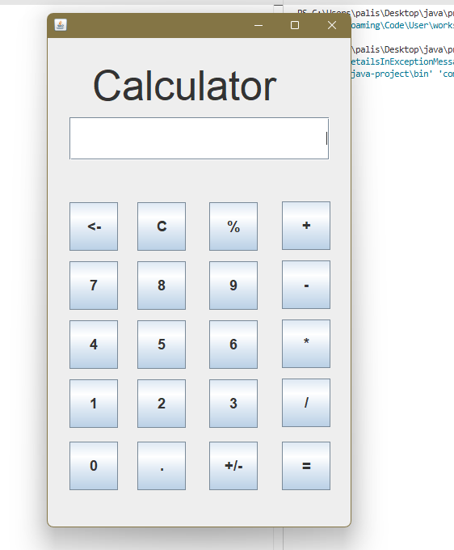

Java Calculator (Swing GUI)
A simple calculator application built in Java using Swing for the graphical interface.
Performs basic arithmetic operations (addition, subtraction, multiplication, division, modulus) with a modern GUI layout.

Features
Addition, subtraction, multiplication, division, and modulus operations
Handles decimal numbers and negative values
Clear (“C”) and backspace (“<-”) buttons
Change sign (“+/-”) button
User-friendly interface with large buttons

How to Run

1. Clone or download this repository.
2. Make sure you have Java 8+ installed.
3. Open a terminal or command prompt in the project folder.
4. Compile the file:
   javac -d . Calculator_Window.java
5. Run the program:
   java com.calculator.Calculator_Window

Screenshots

