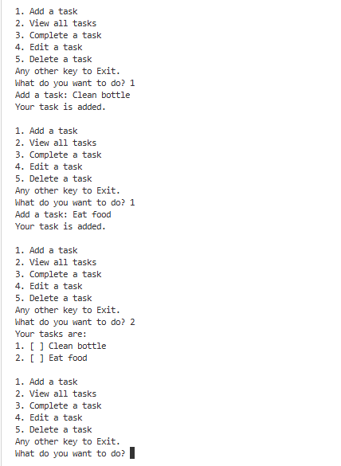
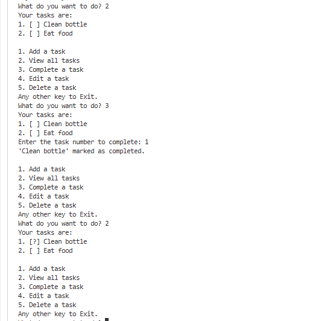

Java To-Do List CLI
A simple command-line To-Do List application built in Java.
This app lets users add, view, complete, edit, and delete tasks—all from the terminal.

Features
Add tasks with a simple description
View all tasks in a numbered list
Mark tasks as completed
Edit tasks by number
Delete tasks by number
Input validation and error handling for user actions

How to Run

1. Clone or download this repository.
2. Make sure you have Java 8+ installed.
3. Open a terminal in the project folder.
4. Compile the file:
   javac todolist.java
5. Run the program:
   java todolist

Screenshots

